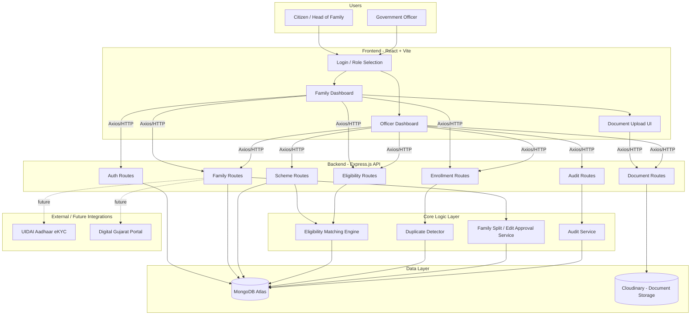

# EkParivar

EkParivar is a government-benefits and family identity management platform designed for Gujarat public welfare workflows. It issues every household a unique **Family ID**, links all members under it, matches families against live government scheme eligibility rules, detects duplicate or overlapping benefit claims, and lets officers manage verification, approvals, and the full lifecycle of a family record — including edits and household splits.

## Overview

This project is split into two main parts:

- **Frontend**: React + Vite application for citizen and officer workflows
- **Backend**: Express.js API with MongoDB persistence, an eligibility-matching engine, and duplicate-detection logic

The app simulates Aadhaar/OTP verification and document upload in demo mode while keeping a production-ready architecture for real government integrations (UIDAI eKYC, Digital Gujarat Portal, DBT-linked bank verification).

## User Roles & Login

EkParivar supports two primary login roles, each with a distinct dashboard and permission set:

| Role | Login Method | Access |
|---|---|---|
| **Citizen / Head of Family (HOF)** | Mobile number + mock OTP | Register family, add/edit members, view Family ID, view eligible schemes, apply/enroll, upload own documents, request edits or family splits |
| **Government Officer** | Mobile number + password (mock) | View all registered families, add/define new schemes and eligibility rules, approve/reject applications and edit requests, verify uploaded documents, view eligibility matrix, resolve duplicate benefit alerts, view audit trail log |

Officers currently cover both scheme-management and admin-level oversight (stats dashboard) in a single role to keep the demo scoped; department-specific officer accounts (Health, Education, Revenue, etc.) are a planned extension via the existing `department` field on the Officer model.

## Architecture Diagram



## System Components

### Frontend
- React 19 application
- Vite build tool
- React Router for role-based navigation (Citizen vs Officer)
- Axios API client with JWT bearer handling
- Government-style dashboard pages with grouped navigation (Applications & Requests, Schemes & Eligibility, Registry & Monitoring)

### Backend
- Express 5 API server
- Mongoose ODM for MongoDB models
- JWT-based authentication
- CORS configuration for local and deployed origins
- Business logic for:
  - Family registration, editing (tiered approval), and splitting
  - Officer approval/rejection of applications and edit requests
  - Benefit scheme creation and eligibility rule definition
  - Automated eligibility matching across all families and schemes
  - Duplicate/overlapping benefit claim detection
  - Document upload, per-member ownership, and verification
  - Full audit trail logging

### Data Layer
- MongoDB collections: `Family`, `Member`, `Officer`, `Scheme`, `EligibilityRule`, `Enrollment`, `EligibilityMatch`, `AuditLog`
- Cloudinary integration for document and asset storage
- Family lineage tracking via `parentFamilyId` for split households

## Key Features

- **Unique Family ID issuance** — one ID per household, linking all members
- **Citizen family registration workflow** with Aadhaar-mock verification
- **Automated eligibility matching engine** — evaluates income, age, gender, category, BPL/widow/disability/pregnancy status, occupation, and education records against scheme rules
- **Duplicate/overlapping benefit detection** — flags members with conflicting active enrollments across departments
- **Officer dashboard** for verification, approval, scheme management, and monitoring
- **Scheme listing and live eligibility matrix**
- **Tiered edit permissions** — instant self-edits (OTP-verified mobile/email) vs. officer-approved restricted edits (name, address, income, category) requiring document proof
- **Family split workflow** — generates a new linked Family ID with lineage tracking when a household splits
- **Per-member document upload and verification** with Cloudinary storage
- **Full audit trail** for every officer and system action
- **Demo-mode Aadhaar and OTP simulation** for hackathon/prototype use

## Project Structure

```text
Pravi/
├── backend/
│   ├── src/
│   │   ├── models/
│   │   ├── routes/
│   │   ├── services/
│   │   └── server.js
│   ├── .env.example
│   ├── package.json
│   ├── pnpm-lock.yaml
│   └── render.yaml
├── frontend/
│   ├── src/
│   ├── public/
│   ├── .env.example
│   ├── package.json
│   ├── pnpm-lock.yaml
│   ├── vite.config.js
│   └── vercel.json
├── .gitignore
├── package.json
├── README.md
└── pnpm-lock.yaml
```

## Prerequisites

Before running the app locally, install:

- Node.js 18+
- pnpm
- MongoDB Atlas connection or a local MongoDB instance

## Local Development Setup

### 1. Install root dependencies

```bash
pnpm install
```

### 2. Start frontend

```bash
pnpm --dir frontend install
pnpm --dir frontend dev
```

### 3. Start backend

```bash
pnpm --dir backend install
pnpm --dir backend dev
```

### 4. Access the app

- Frontend: http://localhost:5173
- Backend: http://localhost:5000

## Environment Variables

### Frontend
Create a `.env` file in `frontend/`:

```env
VITE_API_BASE_URL=http://localhost:5000/api
```

### Backend
Create a `.env` file in `backend/`:

```env
PORT=5000
MONGODB_URI=mongodb+srv://<username>:<password>@<cluster>.mongodb.net/<dbname>
CORS_ORIGIN=http://localhost:5173,http://127.0.0.1:5173
CLOUDINARY_CLOUD_NAME=
CLOUDINARY_API_KEY=
CLOUDINARY_API_SECRET=
JWT_SECRET=your_jwt_secret_here
JWT_EXPIRES_IN=7d
```

## Deployment

### Vercel (Frontend)
1. Import the project into Vercel.
2. Set root directory to `frontend`.
3. Set build command:
   ```bash
   pnpm run build
   ```
4. Set output directory:
   ```bash
   dist
   ```
5. Add environment variable:
   ```env
   VITE_API_BASE_URL=https://your-render-backend-url.onrender.com/api
   ```

### Render (Backend)
1. Create a new Web Service in Render.
2. Set root directory to `backend`.
3. Use build command:
   ```bash
   npm install
   ```
4. Use start command:
   ```bash
   npm start
   ```
5. Add environment variables from `.env.example`.

## Scripts

### Root
```bash
pnpm dev
pnpm --dir frontend dev
pnpm --dir backend dev
```

### Frontend
```bash
pnpm --dir frontend build
pnpm --dir frontend lint
```

### Backend
```bash
pnpm --dir backend start
pnpm --dir backend dev
```

## Roadmap / Future Enhancements

- Replace mock Aadhaar/OTP verification with real UIDAI eKYC integration
- Department-specific officer accounts (Health, Education, Revenue, Food & Civil Supplies)
- Real cloud document storage with automated OCR-based verification
- Multi-level approval workflow for high-value scheme enrollments
- Integration with Digital Gujarat Portal as the unified citizen-facing entry point

## Notes

- The app is demo-ready and designed for government workflow simulation.
- Aadhaar verification and OTP flows are mocked in demo mode for hackathon or prototype usage.
- Real production deployment should replace mock identity checks with secure official APIs and proper RBAC policies.

## License

This project is intended for educational and prototype use within an internal development workflow.

## Repository

[https://github.com/PatelApurv22/EkParivar](https://github.com/PatelApurv22/EkParivar)
