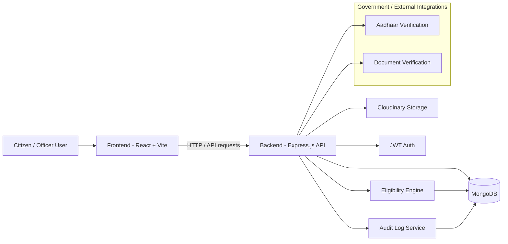

# EkParivar

EkParivar is a government-benefits and family identity management platform designed for Gujarat public welfare workflows. It helps citizens apply for family IDs, track application status, review eligible schemes, and lets officers approve or reject applications with audit tracking.

## Overview

This project is split into two main parts:

- Frontend: React + Vite application for citizen and officer workflows
- Backend: Express.js API with MongoDB persistence and eligibility logic

The app simulates Aadhaar/OTP verification in demo mode while keeping a production-ready architecture for real government integrations.

## Architecture Diagram



## System Components

### Frontend
- React 19 application
- Vite build tool
- React Router for role-based navigation
- Axios API client with JWT bearer handling
- Government-style dashboard pages

### Backend
- Express 5 API server
- Mongoose ODM for MongoDB models
- JWT-based authentication
- CORS configuration for local and deployed origins
- Business logic for:
  - family applications
  - officer approval/rejection
  - benefit scheme eligibility
  - document upload management
  - audit trails

### Data Layer
- MongoDB collections for families, members, schemes, applications, audits, documents, and eligibility matches
- Cloudinary integration for document and asset storage

## Key Features

- Citizen family registration workflow
- Officer dashboard for verification and approval
- Scheme listing and eligibility matching
- Family card / family ID issuance
- Document upload and document viewing
- Split and edit request workflows
- Audit logs for transparent government processes
- Demo-mode Aadhaar and OTP simulation

## Project Structure

```text
Pravi/
├── backend/
│   ├── src/
│   │   ├── models/
│   │   ├── routes/
│   │   ├── services/
│   │   └── server.js
│   ├── .env.example
│   ├── package.json
│   ├── pnpm-lock.yaml
│   └── render.yaml
├── frontend/
│   ├── src/
│   ├── public/
│   ├── .env.example
│   ├── package.json
│   ├── pnpm-lock.yaml
│   ├── vite.config.js
│   └── vercel.json
├── .gitignore
├── package.json
├── README.md
└── pnpm-lock.yaml
```

## Prerequisites

Before running the app locally, install:

- Node.js 18+
- pnpm
- MongoDB Atlas connection or a local MongoDB instance

## Local Development Setup

### 1. Install root dependencies

```bash
pnpm install
```

### 2. Start frontend

```bash
pnpm --dir frontend install
pnpm --dir frontend dev
```

### 3. Start backend

```bash
pnpm --dir backend install
pnpm --dir backend dev
```

### 4. Access the app

- Frontend: http://localhost:5173
- Backend: http://localhost:5000

## Environment Variables

### Frontend
Create a `.env` file in `frontend/`:

```env
VITE_API_BASE_URL=http://localhost:5000/api
```

### Backend
Create a `.env` file in `backend/`:

```env
PORT=5000
MONGODB_URI=mongodb+srv://<username>:<password>@<cluster>.mongodb.net/<dbname>
CORS_ORIGIN=http://localhost:5173,http://127.0.0.1:5173
CLOUDINARY_CLOUD_NAME=
CLOUDINARY_API_KEY=
CLOUDINARY_API_SECRET=
JWT_SECRET=your_jwt_secret_here
JWT_EXPIRES_IN=7d
```

## Deployment

### Vercel (Frontend)
1. Import the project into Vercel.
2. Set root directory to `frontend`.
3. Set build command:
   ```bash
   pnpm run build
   ```
4. Set output directory:
   ```bash
   dist
   ```
5. Add environment variable:
   ```env
   VITE_API_BASE_URL=https://your-render-backend-url.onrender.com/api
   ```

### Render (Backend)
1. Create a new Web Service in Render.
2. Set root directory to `backend`.
3. Use build command:
   ```bash
   npm install
   ```
4. Use start command:
   ```bash
   npm start
   ```
5. Add environment variables from `.env.example`.

## Scripts

### Root
```bash
pnpm dev
pnpm --dir frontend dev
pnpm --dir backend dev
```

### Frontend
```bash
pnpm --dir frontend build
pnpm --dir frontend lint
```

### Backend
```bash
pnpm --dir backend start
pnpm --dir backend dev
```

## Notes

- The app is demo-ready and designed for government workflow simulation.
- Aadhaar verification and OTP flows are mocked in demo mode for hackathon or prototype usage.
- Real production deployment should replace mock identity checks with secure official APIs and proper RBAC policies.

## License

This project is intended for educational and prototype use within an internal development workflow.
